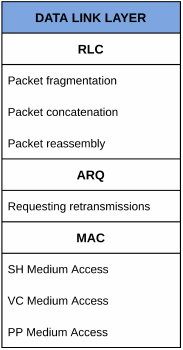

# Introduction

## Purpose of the Document
This document specifies the LDACS Air/Air (A/A) Data Link layer, in particular the Multi Channel Self-Organized Time Division Multiple Access (MCSOTDMA) protocol, as it has been proposed within the Inter Aircraft Network research project.
It may be understood as a proposal for an appendix to the LDACS Air/Ground (A/G) link specification in @grauplLDACSSpecification2018.
It should enable others to implement the Data Link layer, and serve as a basis for integration into a future LDACS standard.

## Organization of the Document
This document is structured by topic.
It attempts to avoid repetitions where possible, and follows a thematic red thread which the authors find reasonable.
Building blocks of the protocol that belong together to achieve a certain function are grouped together, so that the reader may follow along without jumping between pages.
At the end of protocol functions, graphical examples often aim to reinforce the reader's understanding.
This red thread is coarsely summarized as

- An introductory part that defines the nomenclature and general concepts behind the protocol.
- The requirements for the Physical (PHY) layer.
- A specification of message types and their formats.
- The Medium Access Control (MAC) sublayer
	- the Shared Channel (SH) and its medium access
	- the Voice Channel (VC) and its medium access
	- the Point-to-Point Channels (PP) and their medium access
- The Automatic Repeat Request (ARQ) sublayer.
- The Radio Link Control (RLC) sublayer.
  
This is a bottom-up traversation of the Data Link layer depicted in [Fig. @fig:intro_protocol-stack].

{#fig:intro_protocol-stack}

## Motivation
The LDACS A/A data link enables direct communications between airborne stations (ASs).
It shall support the operation of the LDACS A/G by extending the LDACS coverage into regions without ground infrastructure, such as oceanic regions.
This can be achieved by using ASs as Network Layer-relays between the ground stations (GSs) and other ASs.
It can also serve as a redundant link for important services if LDACS A/G is available.

The number of users that must self-organize communication through LDACS A/A varies strongly with the geographic region.
In oceanic scenarios such as the North Atlantic Corridor (NAC), dozens of users may be within communication range.
In continental scenarios, in particular around large, international airports, this number might exceed 1000 users in the future.
For this reason, a main challenge has been the design of the Medium Access Control (MAC) sublayer.
To achieve coexistence with LDACS A/G, Time Division Multiple Access (TDMA) is employed.
To achieve acceptable performance even in densely crowded areas, Frequency Division Multiple Access (FDMA) is employed.
From these, LDACS A/A communication resources are slots in both time and frequency.
This results in a multitude of logical channels that can be time-scheduled.
To manage the necessary coordination, a Shared Channel (SH) is used.
The medium access on the SH is specially designed to scale to arbitrary numbers of users, and the packet delay scales accordingly.
The medium access delay on the PPs, on the other hand, is deterministic on established links, and link establishment requires only few channel accesses on the SH.