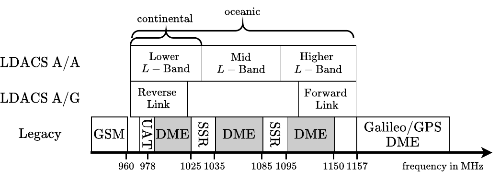
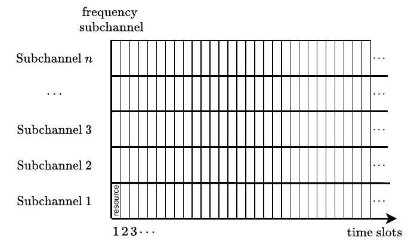
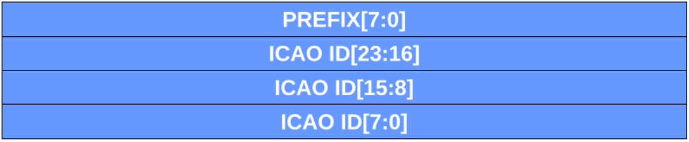

# General Concepts and Nomenclature
## An LDACS A/A User
An LDACS A/A user is defined as an LDACS A/A radio system.

## Communication Resources
The aeronautical L-Band considered for LDACS spans the spectrum from 955.75 to 1164.25 MHz and some of its allocation to different technologies is visualized in [Fig. @fig:concepts_freq-allocation].
LDACS A/A is going to operate in this range, but must coexist with the present legacy systems.
The range is subdivided into three parts: the Lower, Mid and Higher L-Band.
The spectrum is divided into 500 kHz-wide subchannels.
Some of these subchannels may locally not be usable by LDACS to account for the local operation of legacy users.

{#fig:concepts_freq-allocation}

{#fig:concepts_resource-grid}

LDACS A/A is likely going to be restricted to the Lower $L$-Band in continental regions to limit interference upon legacy systems.
The MAC will realize FDMA and coordinate the access on the 500 kHz-wide subchannels.
The MAC will also realize TDMA and divide time into time slots.
The division of the two dimensions of frequency and time yields the communication resources that the MAC controls: each communication resource is a pair of frequency subchannel and time slot.
Since both frequency and time are divided into "slots", it is natural to use "slot" as a synonym for such a communication resource, i.e. it means a specific slot in both domains.
In consequence, a resource grid as depicted in [Fig. @fig:concepts_resource-grid] is obtained.
A clear assignment of subchannel index to center frequency is necessary, however, and must be the same at all LDACS users within one geographical region, as shown in the following table.

| Index | Role | Name | Center Frequency | 
|-------|------|------|------------------|
| $0,\ldots,i$ | $\text{SH}$ | Shared Subchannel | $\{f_i\}$ | 
| $i+1$ | $\text{VC}$ | Broadcast Voice Subchannel | $f_{i+1}$ | 
| $i+2$ | $\text{PP}_1$ | Point-to-Point Subchannel 1 | $f_{i+2}$ | 
| ... | $\text{PP}_j$ | Point-to-Point Subchannel $j$ | $f_{i+j}$ | 
| $i+1+n$ | $\text{PP}_n$ | Point-to-Point Subchannel $n$ | $f_{i+n}$ | 
Table: Assignment of center frequencies to roles for one geographic region. In border regions, two SH channels may be present. Additional SH channels may serve as backups when one is being disturbed.

The utilization of these slots must follow two basic rules, as the installed hardware imposes restrictions on simultaneous reception and transmission.
First, with $m$ available receivers, one LDACS user can listen on $m$ subchannels simultaneously; it can schedule $m$ resources on different subchannels at the same time slot to receive on.
Second, during transmission on one subchannel, reception on neighboring subchannels may be impossible as a local transmission potentially "blinds" the receivers.

### Time Slot Durations
Time slots can have durations of either 6, 12 or 24ms.

## The Shared Channel (SH)
The SH is one frequency subchannel that is shared among all users, and consequently has a contention proportional to the number of active LDACS users within communication range.
Besides broadcast data communication, it serves as a control channel to manage scheduling point-to-point communication links between user pairs, for which the PPs are used.

## The Point-to-Point Channels (PPs)
Point-to-Point Channels (PPs) are used for data communication between pairs of users.
The number of PPs depends on the final decision on the LDACS A/A frequency range, and on the filter requirements as potentially guard bands are required to allow the simultaneous utilization of neighboring PPs by different user pairs.
The medium access on PPs is mutually coordinated through control messages via the SH.

## Broadcast Voice Channel (VC)
A Broadcast Voice Channel (VC) realizes one-hop broadcast voice communication.
Point-to-point voice communication can be realized via any PP channel.

## MAC IDs
Each LDACS user is associated to a unique MAC ID as shown in [Fig. @fig:mac_id].
It contains an 8-bit prefix of zeroes and the 24-bit ICAO ID.
The 28-bit LDACS A/G Unique Address can be used when the prefix is reduced to 4-bit.
A symbolic broadcast MAC ID consists of all-ones.

{#fig:mac_id}

## Reservation Tables{#sec:2_res_table}
After dividing the frequency domain into subchannels, the SH, VC and PPs are obtained.
To time-multiplex these into time slots, reservation tables are employed.
Each subchannel is therefore associated with a reservation table of a size $\texttt{planning\_{}horizon}$.
This table saves the planned actions (reservations) and a corresponding MAC ID of future time slots.
The size of the table, i.e. the number of future time slots, must be large enough to cover the maximum slot offset in a SH header of 16384 in case of the SH table, and large enough to cover the maximum slot offset plus the latest slot of a PP link in case of PP tables.
For example, if a PP link begins in 16384 time slots, then it is valid for a number of exchanges, and each exchange is separated by a link-specific number of time slots; the PP reservation table must be capable of saving these resource reservations.

The following actions can be saved:

- Reception `RX`, if the LDACS user is going to listen to the subchannel associated to the reservation table during the time slot.
- Transmission `TX`, if the LDACS user is going to transmit on the subchannel associated to the reservation table during the time slot.
- Busy `BUSY`, if the LDACS user has been informed that a neighboring user is going to transmit on the subchannel associated to the reservation table during the time slot.
- Idle `IDLE`, if none of the other actions apply; this is the default action of all resources.

During resource scheduling, the MAC makes use of these reservation tables to identify suitable resources for communication.
In order to meet hardware limitations, reservation tables are also associated to transmitter and receiver hardware.
Consequently, a resource can be deemed "suitable for communication" if and only if it is currently `IDLE`, and, depending on the action to be performed, the corresponding hardware's reservation table is `IDLE`, too.
For example, a time slot on a PP channel could be `IDLE`, but to reserve it for transmission, the same time slot must also be `IDLE` in the transmitter's reservation table.

Each reservation is also associated to a MAC ID, so that a reservation clearly identifies to which user a transmission is addressed, or whose transmission is expected to be received.
For example, if a time slot on the SH channel should be used for transmission, its reservation would read `TX@SYMBOLIC_BROADCAST_ID`.

## Blocked Subchannels{#sec:2_blocked_channels}
[Fig. @fig:concepts_freq-allocation] suggests that LDACS is going to coexist with a number of communication systems.
In order to guarantee that communication through LDACS does not cause interference upon these systems, a channel blocklist is employed.
The AS maintains a database that maps geographic positions to a set of frequency subchannels that are not allowed to be used within the geographic region.
This database can be updated prior to takeoff.
In consequence, when reservation tables are queried for suitable communication resources, a first check against this database must be performed, and if the corresponding frequency subchannel is locally blocked, then it must be ignored.

The database should have the following format, with a list of identifying corner points as triples of (latitude, longitude, altitude) spanning a polygon.
Inside the described area, a list of subchannels must not be used.

| List of identifiers | List of blocked subchannels |
| ------------------- | --------------------------- |
| $(\text{lat}, \text{lon}, \text{alt})_1, \ldots, (\text{lat}, \text{lon}, \text{alt})_i$ | $f_j, \ldots, f_k$ |

## Coexistence between LDACS A/G and A/A
The LDACS A/A MAC schedules communication resources for transmission and reception.
Point-to-Point channels in particular are scheduled for relatively long time spans.
As stated before, communication hardware and the LDACS Reverse and Reverse Links are shared between LDACS A/G and A/A.
Generally, LDACS A/G operation will take priority over LDACS A/A communication.
Therefore, in order to achieve an efficient LDACS A/A MAC, it must know in advance which resources can be utilized.
The LDACS A/G MAC must inform the LDACS A/A MAC about the resources it can utilize.
First, it must broadcast with its cell info the channel blocklist described in [Sec. @sec:2_blocked_channels].
Second, it must inform recipients of the subchannel index that corresponds to the SH.
Third, it must inform recipients which LDACS A/G multi-frame out of a superframe can be used for LDACS A/A communications.
To achieve this, the offset of the multi-frame inside the superframe and the period are required at least.
If necessary, e.g. to be able to meet requirements of voice channels, additionally start and end tiles of the multi-frame can restrict the portion of the multi-frame that can be used for LDACS A/A.

## Minimum Processing Time{#sec:processing_time}
A minimum processing time of two 6ms time slots is imposed.
No reaction of an LDACS A/A user before this processing time can be expected.
For example, if a link request is transmitted, the time until a link reply can be prepared is at least two 6ms time slots.
This matches a 12ms processing time specified for LDACS A/G.

## Upper Layer Interface{#sec:upper_layer_interface}
The Data Link layer exposes an interface to an IPv6 upper layer.
This interface has three parameters:

- `data`: The data to be transmitted.
- `destination`: The MAC ID of the destination.
- `priority`: The priority level between 0 and 7 of the transmitted data, either acknowledged or unacknowledged. The appropriate mapping of priority levels is left to the upper layer.

## Physical Layer Requirements{#sec:phy_reqs}
The Physical Layer (PHY) must implement the following requirements.

- It must be possible for the Data Link Layer to tune hardware transmitters and receivers to particular subchannel's center frequencies.
- It must be possible to select the coding and modulation scheme for a packet transmission.
- The PHY must measure the received signal strength (SINR) and noise floor for each packet and forward this measurement to the MAC, which keeps a mapping from MAC ID to subchannel index and most recent signal strength as follows:

| MAC ID | Subchannel Index | Value |
|--------|------------------|-------|
| `id`   | $i$              | $v$
