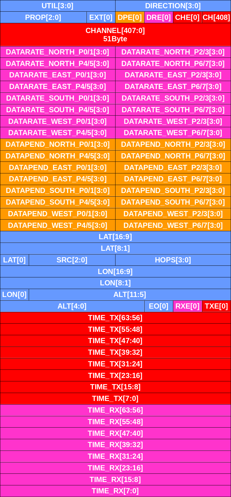

# Layer 2 Frame Format{#sec:3_frame_format}
In this section, the data structure of SH and PP packets are presented. 

## SH Frame Composition{#sec:3_frame_format_SH}
{#fig:headers_sh_overview}

Each data packet transmitted on the SH is structurally composed as shown in [Fig. @fig:headers_sh_overview].
In the following, each header field is presented in detail.
In all packets, there will be

- a signature, see [Fig. @fig:headers_signature]

{#fig:headers_signature}

- a source ID, see [Fig. @fig:headers_mac_id]

{#fig:headers_mac_id}

- fields that identify the next SH channel access, see [Fig. @fig:headers_sh_access]
	- the `offset` field indicates the number of slots + 1 until the next SH transmission
	- the `length` field indicates whether a $6, 12$ or $24$ millisecond slot duration will be used as defined in [Tbl. @tbl:length]

	| bits | meaning |
	| ---- | ------- |
	| `00` | unset |
	| `01` | 6 ms |
	| `10` | 12 ms |
	| `11` | 24 ms |
	Table: definition of `length` field {#tbl:length}

{#fig:headers_sh_access}

- fields that indicate the current status at the user, see [Fig. @fig:headers_link_status]
	- the `util` field indicates the number of subsequent link utilization blocks, each one in the format of Fig. @fig:headers_link_utilization
	- the `direction` field corresponds to a bitmask of `N`, `E`, `S`, `W`
		- the user can indicate in which geographic direction they require a PP data link
	- the `prop` field indicates the number of subsequent link proposal blocks, each one in the format of Fig. @fig:headers_link_proposal
	- the `ext` flag requests a time value for two-way ranging
	- the `dpe` flag enables the `datapend` block with pending data categorized by direction and priority, each in $16 \cdot 2^x$ bytes
	- the `dre` flag enabled the `datarate` block with required data rates categorized by direction and priority, each in $16 \cdot 2^x$ bytes per second
	- a `lat` field with the Compact Position Report (CPR)-formatted latitude
	- a `lon` field with the CPR-formatted longitude
	- an `alt` field with the CPR-formatted altitude
	- a `src` field that indicates whether the reference for time synchronization is GNSS, an LDACS ground station, or an LDACS airborne station
	- a `hops` field that indicates the number of hops the time reference
	- an `eo` bit that indicates whether the CPR-formatted position report was even or odd
	- an `rxe` bit that enables the `time_rx` field for start of reception in nanoseconds in response to the latest user's set `ext` flag
	- a `txe` bit that enables the `time_tx` field for start of transmission in nanoseconds 

{#fig:headers_link_status}

- potentially a number link utilization blocks, see [Fig. @fig:headers_link_utilization]
	- the `offset` field indicates the number of slots + 1 of the next channel access relative to the current packet
	- the `length` field indicates whether a $6, 12$ or $24$ millisecond slot duration will be used as defined in [Tbl. @tbl:length]
	- the `forward`, `reverse` fields indicate the number of transmissions by the link initiator or link recipient resp. per exchange
	- the `period` field indicates the periodicity of channel access on a link as $5 \cdot 2^x$ slots
	- the `frq` field indicates the frequency channel index
	- the `exchange` field indicates the number of exchanges + 1 left until link expiry

{#fig:headers_link_utilization}

- potentially a number of link proposal blocks, see [Fig. @fig:headers_link_proposal]
	- the `offset` field indicates the number of slots + 1 of the next channel access relative to the current packet
	- the `length` field indicates whether a $6, 12$ or $24$ millisecond slot duration will be used as defined in [Tbl. @tbl:length]
	- the `noise` field indicates the $3\text{dB} \cdot x$ value of measured noise level above own receiver noise level
	- the `period` field indicates the periodicity of channel access on a link as $5 \cdot 2^x$ slots
	- the `frq` field indicates the frequency channel index

{#fig:headers_link_proposal}

- potentially link establishment messages, see [Figs. @fig:headers_link_request] [to @fig:headers_link_error]
	- the `modulation` field indicates `0=BPSK_1/3; 1=BPSK_1/2; 2=QPSK_1/3; 3=QPSK_1/2; 4=QPSK_2/3; 5=QPSK_3/4; 6=16QAM_1/2; 7=16QAM_2/3; 8=16QAM_3/4`
	- the `type` field indicates `0=End-of-Messages; 1=LINK-ONE-WAY-DIS; 2=LINK-TWO-WAY-DIS-RQST; 3=LINK-TWO-WAY-DIS-RPLY; 4=LINK-TWO-WAY-STS-RQST; 5=LINK-TWO-WAY-STS-RPLY; 6=LINK-RENEWAL; 7=LINK-ERROR`
	- the `destination` field holds the destination's MAC ID
	- the `offset` field indicates the number of slots + 1 until first channel access relative to the current packet
	- the `length` field indicates whether a $6, 12$ or $24$ millisecond slot duration will be used as defined in [Tbl. @tbl:length]
	- the `forward`, `reverse` fields indicate the number of transmissions by the link initiator or link recipient resp. per exchange
	- the `period` field indicates the periodicity of channel access on a link as $5 \cdot 2^x$ slots
	- the `frq` field indicates the frequency channel index
	- the `exchange` field indicates the number of exchanges left until link expiry
	- the `mode` field indicates `0=AES-128-CMAC; 1=AES-256-CMAC; 2=AES-128-GCM; 3=AES-256-GCM`
	- the `s` bit disambiguates the symmetry of the ECC-point
	- the `value` field carries the ECC-point in uncompressed or compressed format 
	- the `error` field carries `[0=Insufficient-Resources; 1=Invalid-Message; 2=Invalid-Duty-Cycle; 3=Invalid-Frequency; 4=Invalid-Direction; 5=Invalid-Modulation; 6=Invalid-Time; 7=Invalid-Key]`
	- the list of these messages is ended by a `type` field with only zeroes

{#fig:headers_link_request}

{#fig:headers_link_reply_dis}

{#fig:headers_link_reply_sts}

{#fig:headers_link_renewal}

{#fig:headers_link_error}

## PP Frame Composition{#sec:3_frame_format_PP}
Each data packet transmitted on any PP will contain the following header fields:

- a Message Authentication Code (MAC) `AES-128/256-CMAC` or `AES-128/256-GCM`
- an Acknowledgement bitmask for received frames from MSb = oldest to LSb = newest in last exchange

{#fig:headers_pp_mac_ack}

- for fragmented, unfragmented and end-of-packet PP packets in [Figs. @fig:headers_pp_fragmented], [@fig:headers_pp_unfragmented] [and @fig:headers_pp_endofpacket]
	- a `FF` fragmenter's first frame flag for marking fragment as the beginning of a MAC-Payload.
	- a `LF` fragmenter's last frame flag for marking fragment as the end of a MAC-Payload.
	- a `FT` fragmenter type bit `0=Unfragmented; 1=Fragmented` to mark the method of delivering a MAC-Payload to the next hop.
	- a `CLASS` packet class field for class of service (see LDACS A/G Specification)
	- an `ACK` bit `0=Unacknowledged; 1=Acknowledged` for classification of MAC-Payload
		- if acknowledged, a 4-bit acknowledgement field is added
	- a `OFFSET` offset to data fragment in MAC-Payload
	- a `LENGTH` length of data fragment in MAC-Payload
	- a `PID` packet ID `ACCEPT;REJECT;IGNORE` for forcefully advancing new as well as ignoring old L2 packets
	- a `RES` bit that is reserved and zero

{#fig:headers_pp_fragmented}

{#fig:headers_pp_unfragmented}

{#fig:headers_pp_endofpacket}