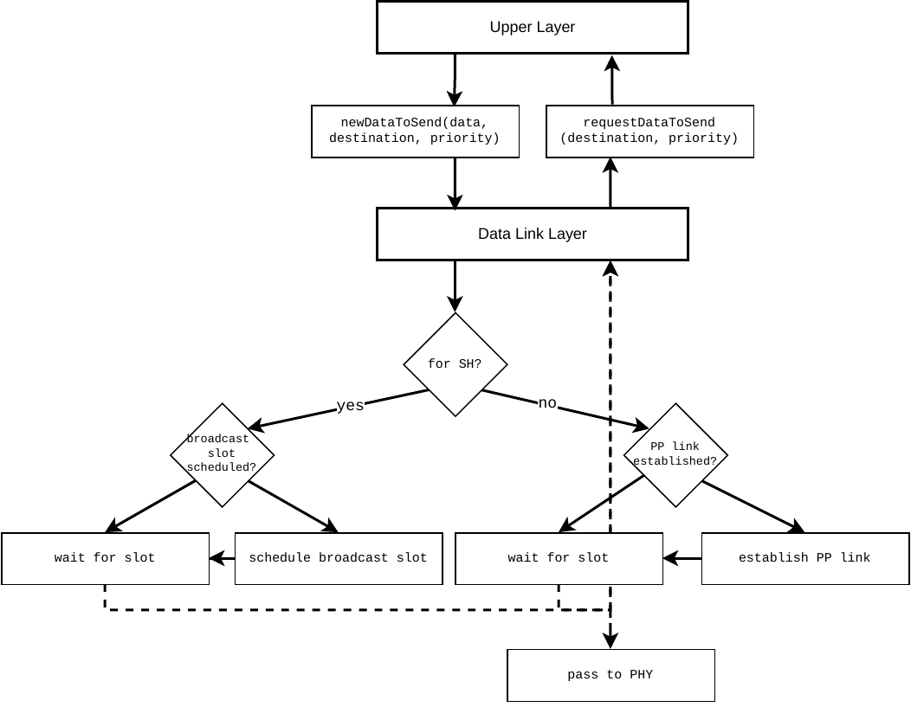
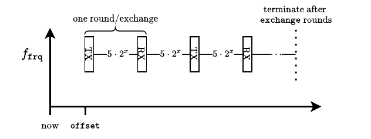

# Medium Access Control (MAC) Sublayer

## Duty Cycle {#sec:4_duty_cycle}
LDACS A/A users have to limit their transmission times to stay within power budgets and to adhere to interference constraints.
By default, this restricts transmission times to 10% of the time.
For the MAC, this imposes stringent constraints on the scheduling of communication resources.
The duty cycle budget of 10% must be shared between all transmissions on SH, VC and PPs and through LDACS A/G, and the 10% threshold must not be violated.
The exact procedure is left to the implementor, and it should allot some minimum budget for SH transmissions, and consider the number of PP links that it should be possible to maintain at all times.
For example, one PP link per geographic direction is advisable to speed up geographic routing.

## The Shared Channel (SH){#sec:4_sh}

### Randomized Reservation-based Slotted ALOHA
#### Incoming Interface for the Upper Layer{#sec:4_sh_interface}
[Fig. @fig:mac_highlevel_diagram] provides a high-level overview about the interface between the MAC and its upper layer.
When new data arrives at the MAC from the upper layer, this is reported to the MAC.
When this data should be sent via the SH, then a broadcast slot is scheduled if it hasn't, already.
If it should be sent via a PP, then an existing link is used if possible, or a link is established and then used.

After scheduling a slot, the user must wait until a transmission slot arrives.
When this slot arrives, data is requested from the upper layer, encapsulated into a MAC frame, and passed down to the PHY layer for transmission.

{#fig:mac_highlevel_diagram}

#### Scheduling a Broadcast Slot{#sec:4_sh_broadcast_scheduling}
First, a minimum offset `min_offset` for the slot to schedule is determined.
This depends on the available duty cycle budget, and it must be checked how much of the budget is being spent on VC, PP and LDACS A/G communication, and the additional transmission at `min_offset` must not violate the budget.

Next, the number of candidate slots `k` can be calculated as
$$
	k = \left\lceil \frac{1}{1 - \sqrt[n]{\frac{1}{e}}} \right\rceil
$${#eq:k}
where $n$ is the number of neighboring LDACS A/A AS.

The $k$ candidate slots are found by querying the SH reservation table, starting at time slot offset `min_offset`, and looking for $k$ `IDLE` resources.
From this set of candidate slots, one slot is selected uniformly randomly, using a pseudo-random number generator that has been seeded with the user's MAC ID.
The selected slot will be used for the next broadcast transmission, and so it is marked as `TX` in the SH reservation table and the transmitter table.

Note that [Eq. @eq:k] is a worst-case approach in a network where users have not advertised next transmission slots to each other.
In such an unsynchronized network, when $k$ is computed using [Eq. @eq:k], an average packet collision probability of $1-\frac{1}{e}$ is achieved.
This allows users to synchronize each other's transmissions over time.
In synchronized networks, $k$ can be limited to smaller values, which removes the guarantee on the average packet reception probability, but reduces packet delays.

#### Broadcasting Data{#sec:4_sh_transmission}
A packet is prepared for transmission before a slot arrives that has been marked as `TX` in the SH reservation table.
Packet content prioritization foresees that:

- at least every second SH data packet must contain the sender's geographic position
- link establishment-related control messages such as link requests and link replies may be delayed and sent on only every second transmission, if necessary
- link utilization takes priority over link proposals
- sending one's own transmission time in the `TIME_TX` link status header fields takes priority over replying to another user's request of their reception time in the `TIME_RX` link status header fields
- datarate-related fields that are toggled through `DRE` and `DPE` flags are optional and can be toggled off
- the channel bitmask is optional and can be toggled off through the `CHE` flag

#### PP Channel Definition{#sec:4_sh_link_definition}
To be concise, a PP channel is parameterized by the fields displayed in [Fig @fig:headers_link_utilization].
A link starts at the earliest transmission slot, `offset` time slots in the future, relative to the current time slot.
For the entire duration of a link, one time slot length is used, indicated in the `length` field.
The sender of the link request is named the link initiator, the sender of the link reply the link recipient.
A link endures as many exchanges as the `exchange` field contains plus one.
Each exchange consists of as many transmissions of the link initiator as the `forward` field contains, and as many transmissions of the link recipient as the `reverse` field contains.
The number of time slots in-between transmission slots is found by reading the `period` field into a variable $x$ and computing the number of slots in-between transmissions as $-1 + 5 \cdot 2^x$.
The `frq` field contains the index of the PP channel that shall be used for this link.
See [Fig. @fig:link_definition].

{#fig:link_definition}

When in the following sections a link request or reply or proposal contain a "link", then these parameters are explicitly meant, which translate implicitly to a set of time slots where link initiator or recipient transmit.
For example, let $\texttt{offset}=3,\, \texttt{forward}=\texttt{reverse}=1, \texttt{exchange}=2, \texttt{period}=1$. 
The effective offset is $3+1$, one exchange consists of two transmissions each, and $2+1$ exchanges happen with $-1 + 5 \cdot 2^1$ time slots in-between channel accesses.
The following channel accesses are made, with `TX` denoting a transmission by the link initiator, and `RX` a transmission by the link recipient:

- `TX@4,14`
- `RX@24,34`
- `TX@44,54`
- `RX@64,74`
- `TX@84,94`,
- `RX@104,114`

#### Determining viable links{#sec:4_sh_viable_link}
A viable link is found by searching local reservation tables.
All resources for transmission and reception must be idle, receiver and transmitter must also be available, and the duty cycle budget must not be exceeded.

#### Populating a Link Request{#sec:4_sh_link_request_population}
When a link request should be sent to a particular neighbor to establish a new PP link, a link request is added to a broadcast message.
If available, that neighbor's proposed links are used.
These are compared to local reservation tables, and the earliest viable, proposed link is used.
If none are viable or no proposals are available, then the user selects the earliest links that are viable.
These must have their first transmission later than the neighbor's next broadcast slot, giving that user time to send a reply.
The processing time must be taken into account as defined in [Sec. @sec:processing_time].
If a link is established through a link reply, resources are scheduled as `TX` or `RX`.
If no link reply is received before the first transmission of the proposed link, resources are set to `IDLE`.

#### Populating a Link Reply{#sec:4_sh_link_reply_population}
Upon reception of a link request, the proposed links therein are checked for viability.
In addition, a proposed link must start later than the next local broadcast transmission, so that there is an opportunity for a link reply.
If several proposed links are valid, the earliest link is chosen, and a link reply is prepared that contains the chosen link's parameters.
If no proposed links are valid, link establishment is started at this user, and an own link request is sent at the next opportunity.
If several link requests are to be answered and not all can be due to packet capacity constraints, the highest-priority ones according to header fields are replied to.
For all others, link establishment is started at this user.

#### Third-Party Link Replies{#sec:4_sh_third_party}
Link requests and replies inform the neighborhoods of the senders about new PP links.
All recipients of a link reply mark the link contained therein as `BUSY`.

#### Populating a Link Proposal{#sec:4_sh_link_proposal_population}
Link proposals intend to inform the neighborhood about PP links that are locally usable, which speed up link establishment, as link initiators can use these proposed links when populating their link requests for this user.
To populate a link proposal, local reservation tables are searched for the best-fitting link that is locally idle and where receiver and transmitter are available, and that satisfies data rate requirements that can be met according to the duty cycle.
As a broadcast message can contain several proposals, these should cover several starting time slots as well as several PP channels to provide diversity both in time and frequency.

#### Neighbor List{#sec:4_sh_reception_neighbor-list}
The reception of packets on the SH from nearby LDACS users is used to update a list of neighbors.
Each time a neighbor's packet is received, its MAC ID field is parsed and that neighbor's entry in this list is updated with the current time slot.

| MAC ID | Reception Time | Reported Transmission Time | Position |
|:-------|:---------------|:---------------------------|:---------|
| `id`   | $t_\text{RX}$  | $t_\text{TX}$              | `lat, lon, alt` |

If a neighbor entry has not been updated for more time slots than it usually takes to receive three broadcasts from this neighbor, then the entry is erased from the list.

##### Receiving Broadcast Messages on the SH{#sec:4_sh_transmission_broadcast}
Broadcast messages contain all the information indicated in [Sec. @sec:3_frame_format_SH].
These are parsed and processed accordingly: neighbor positions are saved, link proposals and utilizations as well, link requests and replies are processed as either third-party or as destined to this user, the next broadcast is saved and the own next transmission potentially re-scheduled if it were to cause a packet collision.

#### Network Entry{#sec:4_sh_beacon_network-entry}
LDACS A/A is a Mobile Ad-Hoc Network (MANET) and thus follows no concept of "cells", as LDACS A/G does.
Network entry is therefore a matter of discovering one's neighbors and their transmission schedules.
Broadcast messages (beacons) are the main driver for this, as all users must periodically broadcast them, and they contain the transmission schedule in their payload.

At power-on, an LDACS user scans the SH until it has received one user's beacon twice, or until many time slots have passed during which no beacon has been received.
This time should be sufficient to discover one's neighbors, and to mark their transmissions in the local reservation tables.
Afterwards, the joining user's own beacon slot is scheduled.

#### Clock Synchronization{#sec:4_sh_beacon_sync}
LDACS clocks are to be synchronized through LDACS A/G.
If LDACS A/G is unavailable, a user can request time values from its neighbors by setting the `ext` flag in its SH packet header.
In response, neighbors set the `time_tx` and `time_rx` fields in their headers, allowing recipients to calculate the packet delay and then agree on a joint time.

#### SH Transition{#sec:4_sh_transition}
It is advisable to select a single LDACS channel as the SH that is globally available, even after taking into account that some channels must locally not be used so that no interference to DME is caused.
If this is not possible, then at specific locations, the logical SH must change frequency channels.
LDACS A/G ground stations should inform connected LDACS A/A users of the local SH center frequency.
A SH transition procedure should cause minimal interruption to LDACS A/A operation when users switch their SH frequency.