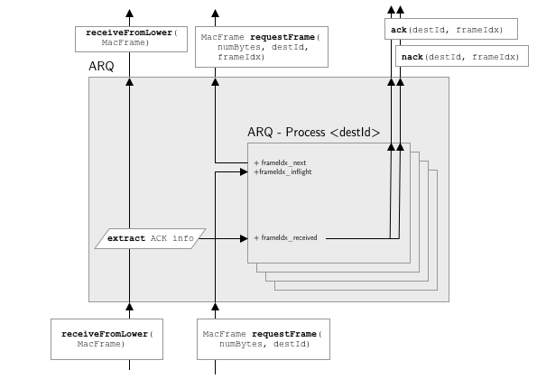

# Automatic Repeat Request (ARQ) Sublayer
The ARQ sublayer realizes reliable data transmissions.
It recognizes when a message from a communication partner went missing and efficiently requests the retransmission of the information included in that message.

## Interfaces
The ARQ sublayer interacts with the RLC sublayer above and the MAC sublayer below it. 
The interface between RLC and ARQ consists of 6 methods as depicted in [Fig. @Fig:arq].

{#fig:arq}

The ARQ exposes `receiveFromLower(macFrame)` to the MAC which is used to pass up a received MAC frame.
The same method is expected on the RLC to further pass up the frame.
In similar fashion, the ARQ exposes the `requestFrame(numBytes, destId)` to the MAC, which is again also expected to exist on the RLC.

Further, it uses the `ack(destId, frameIdx)` and `nack(destId, frameIdx)` on the RLC to communicate the reception status of MAC frames.

## Operation
The ARQ only operates on PP links. 
Here, transmissions alternate between communication partners so that there are never more than 4 MAC frames transmitted before the communication partner has the chance to answer and acknowledge the preceding transmissions.
The ARQ holds an independen state for each PP channel, managed by a dedicated ARQ process as shown in [Fig. @Fig:arq].
This state is composed of three variables: 
`frameIdx_next` is a counter that represents the index of the next MAC frame send in the current exchange. 
The list `frameIdx_inflight` contains the indices of all frames already sent in this exchange.
While frames are received from the communication partner, the indices of the received frames are stored in the `frameIdx_received` list.

Whenever a data exchange starts for a given destination and the `requestFrame(numBytes, destId)` is called, the corresponding ARQ process resets its `frameIdx_next` variable to 0, requests a MAC frame from the RLC with `frameIdx_next` as `frameIdx`, marks it as in-flight and increments it. The same procedure is repeated for all other transmissions in this exchange. 
Whenever a MAC frame is received, the `ACKNOWLEDGEMENT` header field is consulted for the acknowledgment status of in-flight MAC frames. Here, the most significant bit indicates `frameIdx = 0` and the least significant bit `frameIdx = 3`. If a bit is set to $1$ the corresponding MAC frame is acknowledged, if if is set to $0$ it is negative acknowledged.
This information is passed up to the RLC.
In addition, the `frameIdx` of the received frame on the other side (derived from the reservation tables) is added to the `frameIdx_received` list.
Whenever a MAC frame is sent, the `ACKNOWLEDGEMENT` bitmask is filled from this list.
When a exchange ends without the reception of a MAC frame from the other side, all `frameIdx` currently in-flight are negative acknowledged on the RLC layer over the `nack(destId, frameIdx)` interface.

