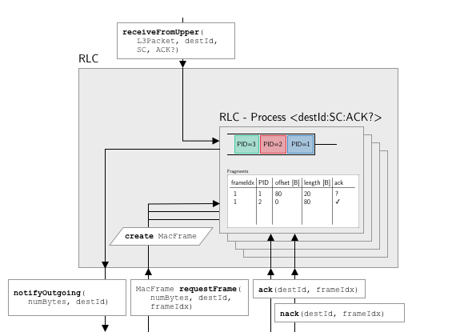

# Radio Link Control (RLC) Sublayer
The RLC sublayer is the highest sublayer in the Data Link layer. 
It receives network layer packets and creates MAC frames based on the needs of the MAC layer.
The amount of network layer data a single MAC frame can carry depends on the currently used time-coding-modulation-scheme (TCMS).
To use the available space efficiently, the RLC implements fragmentation and concatenation of network layer packets.
This means, that a network layer packet can be transmitted in several fragments and a MAC frame can contain fragments from several network layer packets. 
Received fragments are reassembled by the RLC.

## Interfaces
The RLC directly interacts with the network layer.
It exposes an interface `receiveFromUpper(L3Packet, destId, CLASS, ACK?)` to receive packets from the network layer.
Here, `L3Packet` is the network layer packet, `destId` is the MAC ID of the destination, `CLASS` the service class and `ACK?` whether acknowledged or unacknowledged transport is requested.
Further it expects a `sendUp(L3Packet, CLASS, ACK?)` interface on the network layer to pass up received network layer packets.

{#fig:rlc_sending}

The interface to its lower layer consist of four methods.
The method `notifyOutgoing(numBytes, destId)` is expected on the lower layer so that the RLC can inform the lower layer about pending data to be sent. 
Further, it exposes a `requestFrame(numBytes, destId, frameIdx)` to allow lower layers to request MAC frames of a given size for a given destination and `ack(destId, frameIdx)` and `nack(destId, frameIdx)` so that the lower layer can acknowledge or negative acknowledge the successful delivery of a MAC frame.

## Operation
Internally, the RLC consists of a collection of RLC processes.
These processes handle the fragmentation and reassembly procedure for each combination of destination MAC ID (`destId`), service class (`CLASS`) and whether it is acknowledged or unacknowledged transport (`ACK?`). 
Each of those processes has a queue for incoming network layer packets.
Whenever a new packet comes into this queue, it gets assigned a packet ID (`PACKET_PID`). For this purpose, every process holds an 8 bit sequence number with modulo arithmetic from which the `PACKET_PIDs` are taken.
Further, each process holds a table where it stores the state of the fragments it created.

Whenever a network layer packet comes into the RLC, it is passed to the corresponding RLC process and put into the queue. The RLC uses the `notifyOutgoing(numBytes, destId)` interface to inform lower layers about the pending data.

For every MAC frame requested through the `requestFrame(numBytes, destId, frameIdx)` interface, the RLC requests payloads from each of the processes related to the `destId`, starting from the highest service class. 
A RLC Process always creates payloads with the maximum amount of upper layer data while only encapsulating data from a single `PACKET_PID`.
If a complete upper layer packet fits, the `FT` flag in the header is set to 0, otherwise it is set to 1 indicating a fragmented packet.
In any case, the `PACKET_LENGTH` field is set to the length of the data in the payload, the `PACKET_PID` field is filled with the `PACKET_PID` and `CLASS` and `ACK` are set according to the same values from the RLC process.
For a fragmented payload, additionally, the `PACKET_OFFSET` field is set to indicate the offset to the start of the included packet in bytes and `LF` and `FF` indicate whether a fragment is the first or last fragment of a packet.
When a MAC frame is requested, but not enough network-layer data is aavailable to fill it completely, it is ended with a "End-of-Packet" payload that has consists of the fields `FF`, `LF`, `RES`, `CLASS`, `ACK` and `FT` all set to `1`.
Each of the processes stores the `frameIdx` together with the payloads it created. 
<!-- Here, a fragment is described by the `PACKET_PID` it is created from, the offset in bytes from the start of the `PACKET_PID`, the length of the fragment and its ACK status. -->
`frameIdx` is a variable managed by the ARQ to indicated the index of a MAC frame in a given exchange between two numbers. 
As there are never more than 4 MAC frames created before the other side has a chance to answer, this variable ranges from 0 to 3.

Before a new data exchange is initiated, the lower layer calls the `ack(destId, frameIdx)` / `nack(destId, frameIdx)` interface, for each of the 4 `frameIdx` from the previous exchange.
This information is again relayed to the corresponding processes and fragments are either marked as successfully delivered or marked for retransmission.
If a new exchange begins without a previous explicit `ack()` / `nack()`, all frames from the previous exchange are considered negative acknowledged.

<!-- ## RLC Parameters

| Variable | Value | Description |
|----------|---------------|-------------|
| $S_\text{frag}^\text{(max)}$ | 2000 | Max fragment size |  -->
